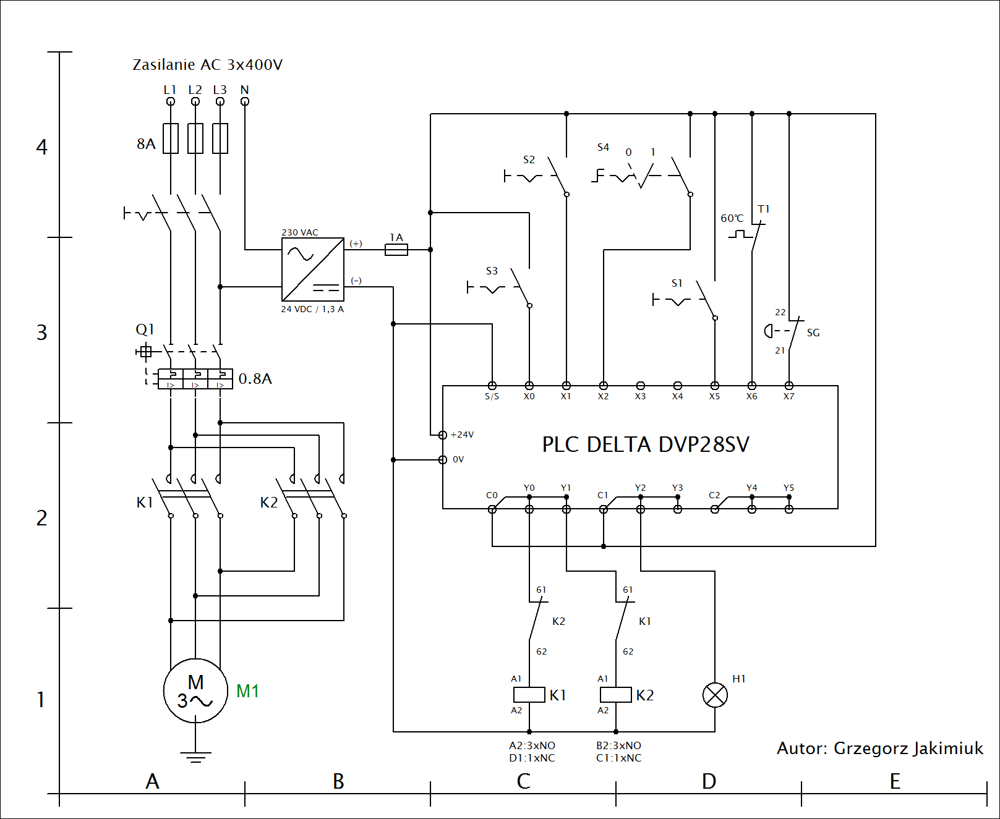

# PLC_Delta_Motor
PLC Motor Start-Stop

Projekt elektryczny realizujący proces uruchamiania silnika trójfazowego z sieci sztywnej w wybranych konfiguracjach. Cechy środowiskowe pracy silnika:

•	Połączenie uzwojeń silnika w trójkąt. 
•	Zasilanie silnika z sieci sztywnej 3x400V. 
•	Brak zastosowanej przekładni mechanicznej. 
•	Napędzanie taśmociągu (niski moment obciążenia). 
•	Logika sterowania realizowana jest z udziałem sterownika PLC. 
•	Środowisko pracy o niskim rygorze ze względu na warunki bezpieczeństwa. 
•	Dwukierunkowe praca silnika. 
•	Zaimplementowane zabezpieczenia: termalne, nadmiaroprądowe oraz przycisk awaryjny. 
•	Układ Start-Stop. 

Dane znamionowe silnika indukcyjnego:

•	Współczynnik mocy: 0.68 
•	Przekładnia wewnętrzna: 20:1 
•	Liczba obrotów na minutę: 1350 rpm 
•	Prąd znamionowy: 0.7A/0.4A 
•	Napięcie znamionowe: 230V/400V 

Wykorzystane rekwizyty:

•	Trzy przyciski monostabilne. 
•	Przycisk bezpieczeństwa. 
•	Sterownik PLC z serii Delta DVP28SV. 
•	Termik w układzie NC. 
•	Dwa styczniki z serii Siemens Sirius z dodatkowymi stykami NC. 
•	Zasilacz 24V o mocy 30W. 
•	Wyłącznik silnikowy Siemens 0.75-1A. Nastawiony na 0.8A 
•	Żarówka 8W 24VDC. 
•	Przełącznik krzywkowy 2-pozycyjny 1xNO. 

Oznaczenia rekwizytów na schemacie:

|Lp|	Indeks|	Opis|
| --- | --- | --- |
|1|	M1|	Silnik 3x400V|
|2|	Q1|	Wyłącznik silnikowy|
|3|	K1/K2|	Praca silnika do przodu / do tyłu|
|4|	S3/S2|	Przycisk Start / Stop|
|5|	S4|	Przełącznik krzywkowy|
|6|	T1|	Wyłącznik termiczny|
|7|	SG|	Wyłącznik bezpieczeństwa|
|8|	H1|	Sygnalizacja błędu|
|9|	8A|	Bezpieczniki topikowe 8A|
|10|	PLC|	Sterownik PLC DVP28SV|

Oznaczenie wejść/wyjść cyfrowych:

|Lp|	I/O|	Opis|
| --- | --- | --- |
|1|	X0|	Start|
|2|	X1|	Stop|
|3|	X2|	Do przodu / Do tyłu|
|4|	X5|	Kasacja błedu|
|5|	X6|	Termik|
|6|	X7|	Wyłącznik bezpieczeństwa|
|7|	Y0|	Do przodu|
|8|	Y1|	Do tyłu|
|9|	Y2| 	Sygnalizacja błędu|
|10|	C1, C2, C3|	Potencjały wspólne|

Schemat elektryczny sterowania:

Sekcja inicjacyjna PLC:

Sekcja logiczna PLC:

